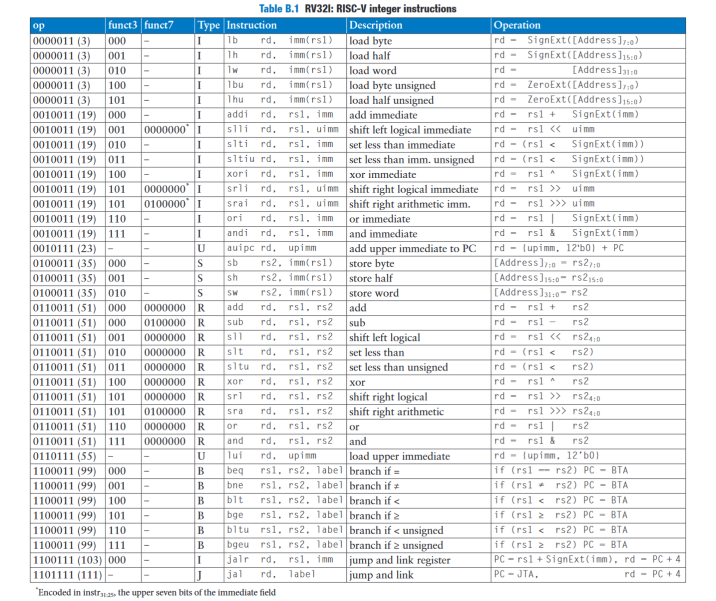
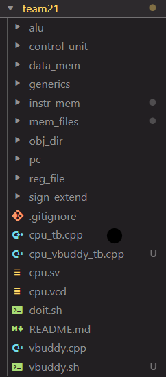
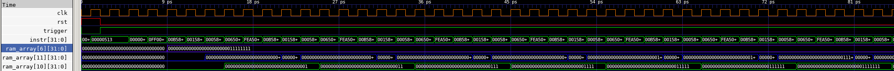

# Team 21's RISC-V CPU

## Table of Contents

- [Quick start](#quick-start)

- [Personal statements](#personal-statements)

- [Contribution table](#contribution-table)

- [Build instructions](#build-instructions)

- Single Cycle ([Test results](#single-cycle-test-results))
    - [ALU](single_cycle/alu.md)
    - [Control Unit](single_cycle/control_unit.md)
	- [Data Memory](single_cycle/data_memory.md)
    - [F1 Program](single_cycle/f1_program.md)
    - [Generics](single_cycle/generics.md)
    - [Instruction Memory](single_cycle/instruction_memory.md)
    - [Mem files](single_cycle/mem_files.md)
	- [Program Counter](single_cycle/program_counter.md)
	- [Register File](single_cycle/register_file.md)
    - [Sign extend](single_cycle/sign_extend.md)

- Pipelining ([Test results](#pipelining-test-results))
    - [Changes made to single cycle components](pipelining/changes_made_to_single_cycle.md)
    - [Hazard unit](pipelining/hazard_unit.md)
	- [Pipelining registers](pipelining/pipelining_registers.md)

- Data Cache ([Test results](#pipelining-with-data-cache-test-results))
	- [Data cache](data_cache/data_cache.md)

## Quick start

From the project, we have produced three variants of a RISCV32I CPU. Each can be found within their own branch in this repository:

- Single cycle ([baseRISCV32I](https://github.com/r0n1tr/team21/tree/baseRISCV32I) branch)
- Pipelined ([baseRISCV32I](https://github.com/r0n1tr/team21/tree/pipelinedRISCV32I) branch)
- Pipelined with data cache ([datacacheRISCV32I](https://github.com/r0n1tr/team21/tree/baseRISCV32I) branch)

Each variant has all instructions in the below table implemented:

*Source: Harris & Harris (2022), Digital Design and Computer Architecture: Risc-V Edition*

Documentation is provided in the [main](https://github.com/r0n1tr/team21/tree/main) branch (that's this one). There is also a [reducedRISCV](https://github.com/r0n1tr/team21/tree/reducedRISCV) branch which was used for Lab 4 and has been kept for reference. 

To help maintain an organised workspace, the CPU has been broken down in a hierarchical manner:

You will find a similar hierachy in this documentation. You can access the relevant documentation files from the [table of contents](#table-of-contents) above. With the exception of personal statements, all documentation in this branch form a joint statement by Team 21.

## Personal statements

| Name                          | GitHub               | Link to Personal Statement                 |
|-------------------------------|----------------------|--------------------------------------------|
| Danial Dehghan                | **daniald1**         | [Danial's Statement](statements/danial.md) |
| Mohammed Tayyab Khalid        | **MohammedTK22**     | [Tayyab's Statement](statements/tayyab.md) |
| Ronit Ravi                    | **r0n1tr**           | [Ronit's Statement](statements/ronit.md)   |
| Ziean Ahmed Sheikh            | **za722-ic**         | [Ziean's Statement](statements/ziean.md)   |

## Contribution table

The following table indicates who contributed to what parts of the CPU.

``0`` = Main Contributor, ``1`` = Co-Contributor

| Task                     | Files                                                                              | Ziean | Ronit | Danial | Tayyab |
|--------------------------|------------------------------------------------------------------------------------|-------|-------|--------|--------|
| _**General**_            | -                                                                                  | -     | -     | -      | -      |
| F1 Program               | f1_fsm.mem                                                                         | 1     | 0     |        | 1      |
| Mem files                | *.mem, *.asm                                                                       | 1     | 1     | 1      | 1      |
| Testbenches              | *_tb.cpp                                                                           | 0     | 1     | 1      | 1      |
| Generics                 |                                                                                    | 1     | 1     | 1      | 1      |
| _**Single-cycle**_       | -                                                                                  | -     | -     | -      | -      |
| ALU                      | top_alu.sv, alu.sv                                                                 | 1     | 0     |        |        |
| Control Unit             | top_control.sv, main_decoder.sv, alu_decoder.sv, branch_decoder.sv, pcsrc_logic.sv | 0     | 1     | 1      |        |
| Data Memory              | data_mem.sv                                                                        | 0     |       | 1      |        |
| Instruction Memory       | instr_mem.sv                                                                       | 0     |       |        |        |
| Program Counter          | top_pc.sv, pcmux.sv, pcreg.sv                                                      | 1     | 1     | 0      | 1      |
| Register file            | reg_file.sv                                                                        |       | 0     |        |        |
| Sign extend              | sign_extend.sv                                                                     | 0     |       |        |        |
| _**Pipelining**_         | -                                                                                  | -     | -     | -      | -      |
| Decode Stage Register    | pipeline_reg_decode.sv                                                             |       | 1     | 0      |        |
| Execute Stage Register   | pipeline_reg_execute.sv                                                            |       | 1     | 0      |        |
| Memory Stage Register    | pipeline_reg_memory.sv                                                             |       | 0     |        |        |
| Writeback Stage Register | pipeline_reg_writeback.sv                                                          |       | 0     |        |        |
| Hazard unit              | Hazard_unit.sv                                                                     |       | 1     |        | 0      |
| _**Data Cache**_         | -                                                                                  | -     | -     | -      | -      |
| Data Cache (1-way)       | cache_1w.mem, cache_1w.sv                                                          |       |       | 1      | 0      |
| Data Cache (2-way)       |  cache_2w.mem, cache_2w.sv                                                         |       |       | 0      | 1      |

## Build instructions

## Single-cycle test results

**Add working evidence of each test program**

### F1 program evidence

**insert evidence**
<iframe width="560" height="315" src="https://youtube.com/shorts/pcnGlPFE5ms?feature=share" frameborder="1" allowfullscreen></iframe>

### PDF program evidence

#### Triangle

**insert evidence**

## Pipelining test results

### F1 program evidence

### PDF program evidence

## Pipelining with Data Cache test results

### F1 program evidence

### PDF program evidence

