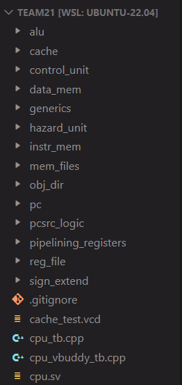

# Team 21's RISC-V CPU

## Table of Contents

- [Quick start](#quick-start)

- [Personal statements](#personal-statements)

- [Contribution table](#contribution-table)

- [Build instructions](#build-instructions)

- Single Cycle ([Test results](#single-cycle-test-results))
    - [ALU](single_cycle/alu.md)
    - [Control Unit](single_cycle/control_unit.md)
	- [Data Memory](single_cycle/data_memory.md)
    - [F1 Program](single_cycle/f1_program.md)
    - [Generics](single_cycle/generics.md)
    - [Instruction Memory](single_cycle/instruction_memory.md)
    - [Mem files](single_cycle/mem_files.md)
	- [Program Counter](single_cycle/program_counter.md)
	- [Register File](single_cycle/register_file.md)
    - [Sign extend](single_cycle/sign_extend.md)

- Pipelining
    - [Changes made to single cycle components](pipelining/changes_made_to_single_cycle.md)
    - [Hazard unit](pipelining/hazard_unit.md)
	- [Pipelining registers](pipelining/pipelining_registers.md)

- Data Cache
    - [Direct mapping](data_cache/direct_mapping.md)
	- [Two way associative](data_cache/two_way_associative.md)


## Quick start

From the project, we have produced three variants of a RISCV32I CPU. Each can be found within their own branch in this repository:

- Single cycle ([```baseRISCV32I```](https://github.com/r0n1tr/team21/tree/baseRISCV32I) branch)
- Pipelined ([```pipelinedRISCV32I```](https://github.com/r0n1tr/team21/tree/pipelinedRISCV32I) branch)
- Pipelined with data cache ([```datacacheRISCV32I```](https://github.com/r0n1tr/team21/tree/baseRISCV32I) branch)

Alternatively, for ease of navigation, the contents of all branches have been placed in different folders in the ```rtl``` branch. 
To begin viewing the CPUs, clone this repository and switch to the branch labelled ```rtl```.

## Base


Pasting the following command in the terminal in ```rtl/rtl-base``` in the ```base``` directory and it should run the Gaussian PDF on your Vbuddy.

```
$ ./base_vbuddy.sh
```


## Pipeline

Pasting the following command in ```rtl/rtl-pipeline``` should plot the Noisy PDF onto the Vbuddy.

```
$ ./pipeline.sh
```


## Cache

Pasting the following command in ```rtl/rtl-cache``` will run the F1 Lights on your Vbuddy.
```
$ ./f1.sh
```

Additionally if you go to ```rtl/rtl-cache/instr_mem/instr_mem.sv/``` and change line 18's "f1_test" to "pdf" and then run:

```
$ ./cache.sh
```

This will plot the Triangle PDF onto your Vbuddy.

Each variant has all instructions in the below table implemented:


*Source: Harris & Harris (2022), Digital Design and Computer Architecture: Risc-V Edition*

Documentation is provided in the [main](https://github.com/r0n1tr/team21/tree/main) branch (that's this one). There is also a [reducedRISCV](https://github.com/r0n1tr/team21/tree/reducedRISCV) branch which was used for Lab 4 and has been kept for reference. 

To help maintain an organised workspace, the CPU has been broken down in a hierarchical manner:



You will find a similar hierachy in this documentation. You can access the relevant documentation files from the [table of contents](#table-of-contents) above. With the exception of personal statements, all documentation in this branch form a joint statement by Team 21.


## Personal statements

| Name                          | GitHub               | Link to Personal Statement                 |
|-------------------------------|----------------------|--------------------------------------------|
| Danial Dehghan                | **daniald1**         | [Danial's Statement](statements/danial.md) |
| Mohammed Tayyab Khalid        | **MohammedTK22**     | [Tayyab's Statement](statements/tayyab.md) |
| Ronit Ravi                    | **r0n1tr**           | [Ronit's Statement](statements/ronit.md)   |
| Ziean Ahmed Sheikh            | **za722-ic**         | [Ziean's Statement](statements/ziean.md)   |

## Contribution table

The following table indicates who contributed to what parts of the CPU.

``0`` = Main Contributor, ``1`` = Co-Contributor

| Task                     | Files                                                                              | Ziean | Ronit | Danial | Tayyab |
|--------------------------|------------------------------------------------------------------------------------|-------|-------|--------|--------|
| _**General**_            | -                                                                                  | -     | -     | -      | -      |
| F1 Program               | f1_fsm.mem                                                                         | 1     | 0     |        | 1      |
| Mem files                | *.mem, *.asm                                                                       | 1     | 1     | 1      | 1      |
| Testbenches              | *_tb.cpp                                                                           | 0     | 1     | 1      | 1      |
| Generics                 |                                                                                    | 1     | 1     | 1      | 1      |
| _**Single-cycle**_       | -                                                                                  | -     | -     | -      | -      |
| ALU                      | top_alu.sv, alu.sv                                                                 | 1     | 0     |        |        |
| Control Unit             | top_control.sv, main_decoder.sv, alu_decoder.sv, branch_decoder.sv, pcsrc_logic.sv | 0     | 1     | 1      |        |
| Data Memory              | data_mem.sv                                                                        | 0     |       | 1      |        |
| Instruction Memory       | instr_mem.sv                                                                       | 0     |       |        |        |
| Program Counter          | top_pc.sv, pcmux.sv, pcreg.sv                                                      | 1     | 1     | 0      | 1      |
| Register file            | reg_file.sv                                                                        |       | 0     |        |        |
| Sign extend              | sign_extend.sv                                                                     | 0     |       |        |        |
| _**Pipelining**_         | -                                                                                  | -     | -     | -      | -      |
| Decode Stage Register    | pipeline_reg_decode.sv                                                             |       | 1     | 0      |        |
| Execute Stage Register   | pipeline_reg_execute.sv                                                            |       | 1     | 0      |        |
| Memory Stage Register    | pipeline_reg_memory.sv                                                             |       | 0     |        |        |
| Writeback Stage Register | pipeline_reg_writeback.sv                                                          |       | 0     |        |        |
| Hazard unit              | Hazard_unit.sv                                                                     |       | 1     |        | 0      |
| _**Data Cache**_         | -                                                                                  | -     | -     | -      | -      |
| Data Cache (1-way)       | cache_1w.mem, cache_1w.sv                                                          |       |       | 1      | 0      |
| Data Cache (2-way)       |  cache_2w.mem, cache_2w.sv                                                         |       |       | 0      | 1      |


## Build instructions

**add shell scripts and other stuff**

## Single-cycle test results
Here is a waveform showing you the instructions for the F1 Lights program read in from the .mem file in the instruction memory, and the following instructions executed evidenced by registers a0, a1 and t1. 


#### F1


https://github.com/r0n1tr/team21/assets/138166258/7664222d-c19f-4ca5-841a-f18ce61c1cc6


### PDF program evidence


#### Gauss

https://github.com/r0n1tr/team21/assets/138166258/592425f5-488d-46e7-aeeb-0efe4ae33906


#### Sine

https://github.com/r0n1tr/team21/assets/138166258/8ed0807e-4cba-42b1-a82c-dee49bd39e88

#### Noise 

https://github.com/r0n1tr/team21/assets/138166258/bc487b51-a17c-4706-ae09-f2ee472b4ed7

#### Triangle

https://github.com/r0n1tr/team21/assets/138166258/e02e9486-631f-421c-a7f5-0fb81988ecdc

## Pipelining with Data Cache test results

For both versions of our CPU with Pipeline with Hazard Unit as well as our separate added Data Cache version, both successfully compile the PDF and F1 programs and output the corresponding waveforms above. To ensure functionality a folder labelled ["vcd_files"](vcd_files/) that have every single file for each reference program on every single version.

### Cache working with the pipelined CPU


When din = 0x000000C8 , the cache checks set 2 if the tags match and the V flag is high, i.e if it's a hit or miss. The hit signal being low indicates a miss, resulting in din propogating to the input of the data memory, a . The data memory returns 0x0 , which is written back, resulting in cache_memory[2] = 0x800000600000000. The 8 at the end is a result of the V flag being set to high, and the tag matches with the tag you'd retrieve from din after neglecting the least significant 5 bits of the word. Therefore, The cache works.

