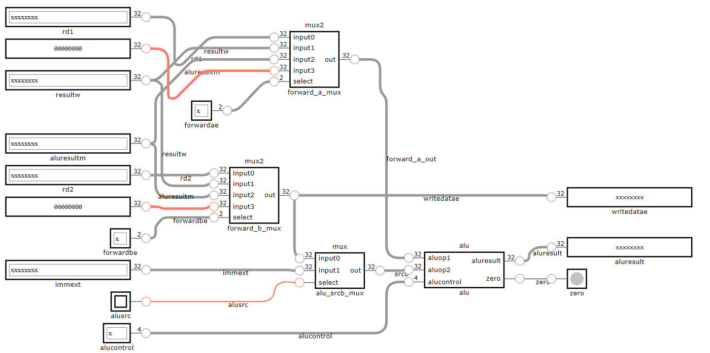

# ALU

The ALU is broken down into 3 main files:
- alu_mux.sv
- alu.sv
- top_alu.sv

By having a top file for each sub-module we could call testbenches to validify functionality as well as have a concise top file when connecting all the modules together.




```verilog

always_comb begin
    case(alucontrol)
        4'b0000: aluresult = aluop1  +  aluop2;       // add            
        4'b0001: aluresult = aluop1  -  aluop2;       // sub            
        4'b0010: aluresult = aluop1 <<  aluop2[4:0];  // shift left logic
        4'b0101: aluresult = aluop1  ^  aluop2;       // xor              
        4'b0110: aluresult = aluop1 >>  aluop2[4:0];  // shift right logical            
        4'b0111: aluresult = aluop1 >>> aluop2[4:0];  // shift right arithmetic         
        4'b1000: aluresult = aluop1  |  aluop2;       // or            
        4'b1001: aluresult = aluop1  &  aluop2;       // and  
        4'b0011: aluresult = (  $signed(aluop1) < $signed(aluop2)) ? 32'b1 : 32'b0; // set less than  
        4'b0100: aluresult = ($unsigned(aluop1) < $unsigned(aluop2)) ? 32'b1 : 32'b0;   // set less than unsigned    
        default: aluresult = {32{1'b1}}; // unrecognised alucontrol
    endcase
    zero = (aluresult == 32'b0); // zero flag check
end
```

The case statement controlled by ``alucontrol``` has designed to be 4 bits long due to the 10 instructions for our design requirements. Although we dont't us all states of the alucontrol switch we have a default case if none of the instructions implemented are called in order to control undefined behaviour.

The combinational block above shows all the instructions we implemented for our ALU as well as having our zero flag functionality concisely in one statement. We additionally added the ```$unsigned``` and ```$signed``` keywords to use ```SLT``` for unsigned and signed inputs. 